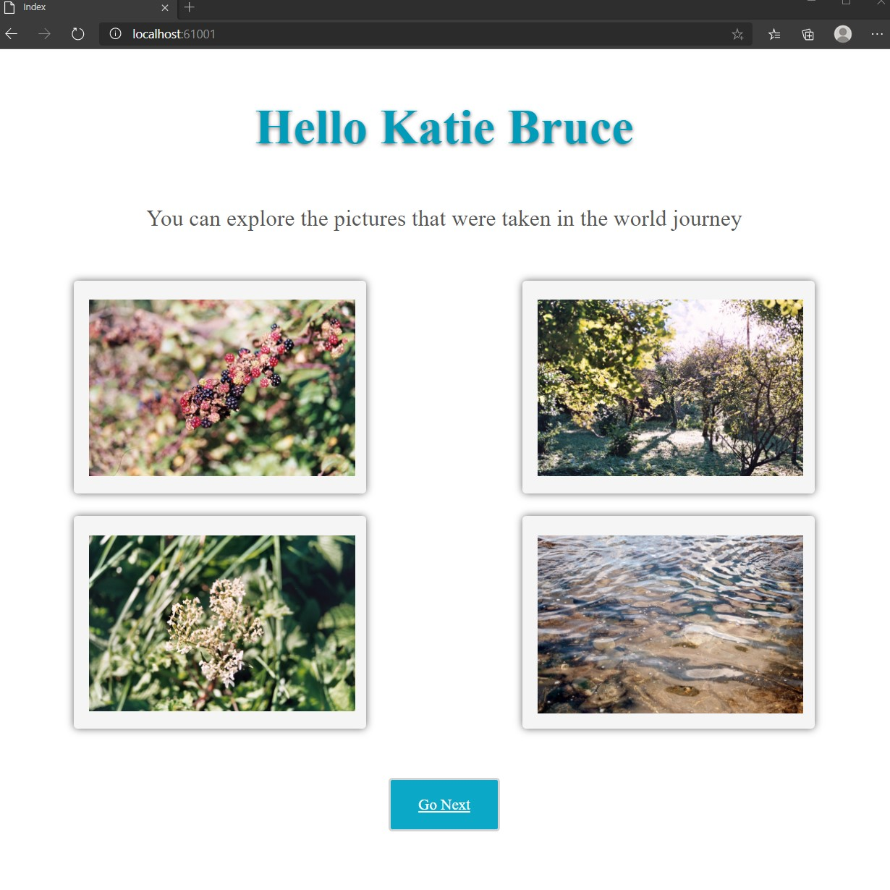
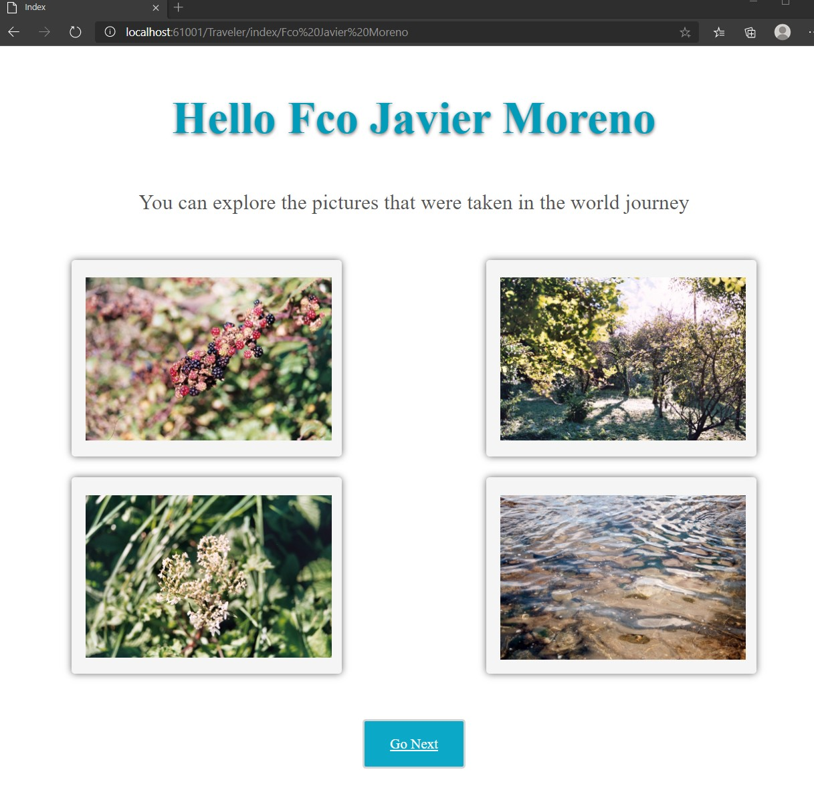

# Module 4: Developing Controllers

## Lab: Developing Controllers

1. **Nombres y apellidos:** Francisco Javier Moreno Quevedo
2. **Fecha:** 06/12/2020
3. **Resumen del Ejercicio:**  1/4
4. **Dificultad o problemas presentados y como se resolvieron:** Ninguna

- Ejercicio 2: Configuring Routes by Using the Routing Table

  - Añadimos el controlador **TravellerController**
  
  - Añadimos un ViewBag en su accion index
  
  - En el middleware **startup.cs**
  
    - Eliminamos la instruccion que toma las rutas por defecto
    - una ruta a este controlador y a la accion index
    - añadimos una ruta al HomeController y a la accion index
  
    
  
  

